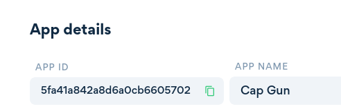

#### Overview

Below are the steps each user will need to follow in order to connect with your app:

<br/>


1. The user will click a **redirection url** from within your app, redirecting them to the HandCash web app, or the HandCash native app.


To generate the **redirection url** your **App ID** will be required. Find your **App ID** by viewing your application inside the HandCash [developer dashboard](https://dashboard.handcash.io):</br>

 

2. The user will sign in to HandCash. If they don't have an account already, they will be prompted to register.

<br/>

3. HandCash will ask the user if they would like to grant permissions to your app.

<br/>

4. The user can **accept** or **decline** access to the your app.

<br/>

>Accept  →  Authorization Success URL. 
>
>Decline  →  Authorization Failed URL.

<br/>


5. HandCash will then redirect the user back to the your app.



While redirecting, an **authToken** query parameter will be added to the request: <br/> `<auth-success-url>?authToken=<token>`
 

<hr>
<br>

#### Your App Authorization

To connect with a user, generate a **redirection url** using the SDK:
 
   {}
```javascript
const {HandCashConnect} = require('@handcash/handcash-connect');
const handCashConnect = new HandCashConnect('<app-id>');

// Use this field to redirect the user to the HandCash authorization screen.
const redirectionLoginUrl =  handCashConnect.getRedirectionUrl();
```
   {}


Users will recognize the HandCash brand if you attach the url to this button; full source code can be found in our [assets page](../assets/):

<br/>




<br/>
<br/>

The user will be redirected to the **HandCash app** and will be asked to grant your app permissions.

<br>

Once the user selects **accept** or **decline**, they will be redirected back your app's **Authorization Success URL** or **Authorization Failed URL**.

<br/>

While redirecting, an **authToken** query parameter will be added to the request: 
>`<auth-success-url>?authToken=<token>`



Any extra query parameters provided will be added to the `<auth-success-url>`. <br/> Ex: `<auth-success-url>?authToken=<token>?`
 


At this point, you may use the **authToken** to view and spend on behalf of the user.

<hr>
<br>

#### Video Walkthrough

Below is a video walkthrough illustrating a demo implementation of the authentication process:


Some of the code in the video may be outdated, please refer to the documentation for up to date code.


 
   {}

   {}

